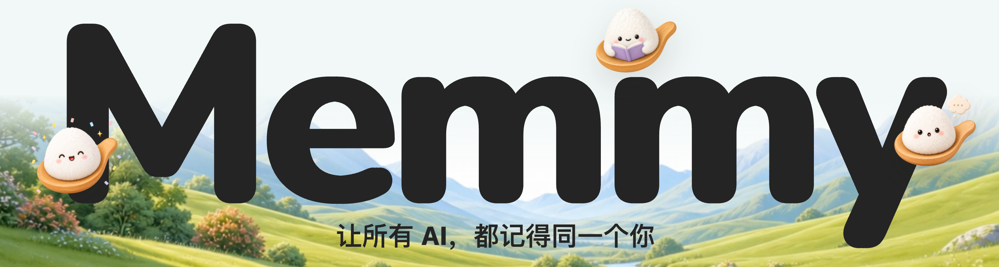

# memmy-agent



Memmy，让所有AI，都记得同一个你

它将你的知识、偏好和项目经验沉淀为个人记忆，并让 Cursor、Claude Code、Codex、OpenClaw 等不同 Agent 共享同一份上下文。

提供桌面应用、CLI 和 API，让你以不同方式使用同一套长期记忆。一次积累，多处使用。

[文档](https://memmy.cn/docs/) • [快速开始](#%E5%BF%AB%E9%80%9F%E5%BC%80%E5%A7%8B) • [核心概念](#%E6%A0%B8%E5%BF%83%E6%A6%82%E5%BF%B5) • [从源码构建](#%E4%BB%8E%E6%BA%90%E7%A0%81%E6%9E%84%E5%BB%BA)

**简体中文** • [English](README.md)

## 🚀 开始体验 Memmy

点击进入[官网下载](https://memmy.cn/)或者[github release](https://github.com/MemTensor/memmy-agent/releases)下载

注册 Memmy 后，即可获得免费 AI 使用额度，系统会自动进行模型调度，帮助你体验完整的 Memory + Agent Runtime。体验额度：

- 注册赠送 30,000,000 Token，可在应用内查看剩余额度和使用情况

当体验额度用尽后，可切换至 BYOK 模式，使用自己的模型 API。

## 什么是 Memmy？

每一次 AI 协作都会产生新的上下文和经验，但这些信息通常被隔离在不同工具和会话中。当你切换 Agent 或工作场景时，新的 AI 又需要重新认识你。

通过 Memmy，Cursor、Claude Code、Codex 等 Agent 可以基于统一上下文持续协作，让 AI 从一次性对话变成长期理解你的 Agent。

### 🧠 跨 Agent 记忆层

Memmy 为所有 AI Agent 提供统一的个人记忆层。

- **跨 Agent 共享记忆**：无论是在 Codex、Claude Code、Cursor 还是 OpenClaw 中工作，都可以继续使用相同的上下文和经验，无需重复介绍背景。
- **MemOS 驱动的记忆引擎**：自动采集、理解并结构化你的知识、偏好和工作经验，将分散的对话和行为沉淀为可检索、可复用的长期记忆。
- **历史上下文接入**：支持导入已有 Agent 的历史记录，将过去的对话和项目经验转化为持续生长的个人知识资产。

### 🕸️ 本地 Agent Runtime

Memmy 提供一套完整的本地 Agent 运行环境。

- **多入口统一体验**：支持桌面端、CLI/TUI 和 OpenAI 兼容 API，共享同一套 Agent、记忆和配置。
- **持续任务协作**：从任意入口开始任务，并可在不同场景中无缝继续，不受单次会话限制。
- **可扩展 Agent 能力**：通过 Skills 和 MCP 连接更多工具，让 Agent 从对话走向实际任务执行。

### 🔬 工具与生态连接

Memmy 可以连接你的工作环境，让 Agent 真正参与日常工作流。

- **连接常用工具**：支持 Telegram、Discord、微信、飞书、钉钉，以及 GitHub、Gmail、Notion、Slack、Jira 等生产力工具。
- **开放工具生态**：支持 MCP 和自定义 Skills，扩展文件处理、Shell、Web、图像生成、自动化任务等能力。
- **灵活模型配置**：支持按需配置推理、Embedding、记忆处理、语音和图像生成模型，兼容主流模型服务。

### 🔐 本地优先，数据属于你

Memmy 从设计上保证用户对个人数据和记忆的控制权。

- **Local-first 架构**：记忆、配置和应用状态默认保存在本机，数据无需上传云端。
- **安全访问控制**：本地服务提供受控访问机制，确保只有授权来源能够调用记忆能力。
- **真实记忆，不制造幻觉**：当记忆服务不可用时，Memmy 会明确反馈错误，而不会返回不存在的“假记忆”。

## 几分钟建立上下文，而不是从零开始

安装 Memmy 后，它可以自动扫描已有 AI Agent 的历史记录。几分钟内，你过去几个月积累的项目上下文、工作习惯和偏好会被转换为个人长期记忆，并生成个性化的「初见报告」。

现已支持：Cursor、Claude Code、Codex、OpenCode、OpenClaw、Hermes Agent。

查看详细支持列表 → 链接到 docs/import-agent-memory.md

## 一套 Agent Runtime，多种使用入口

Memmy 不只是一个聊天界面，而是一套运行在本地的 AI Agent Runtime。 它将长期记忆、Agent 执行能力和工具连接统一在同一个运行环境中，并通过不同入口服务不同使用场景：

|                      | 作用                 | 核心能力                                    |
| -------------------- | -------------------- | ------------------------------------------- |
| 🧠 Memory Layer      | 保存和管理长期上下文 | 跨 Agent 记忆、历史导入、知识沉淀、智能检索 |
| 🤖 Agent Runtime     | 驱动 Agent 执行任务  | 推理、任务编排、工具调用、MCP、Skill        |
| 🔌 Integration Layer | 连接外部生态         | 消息渠道、第三方工具、OpenAI 兼容 API       |
| 🖥️ User Interface  | 提供使用入口         | Desktop App、CLI/TUI、Web 接口              |

### 仓库架构

Memmy 采用 npm workspaces monorepo 架构：


## Memmy vs Personal AI Agents

和 Hermes、OpenClaw 这类「个人 AI Agent」相比，Memmy 的差异不在于「又一个能陪你聊天/办事的助理」，而在于它是一层**跨 Agent 共享的记忆底座**——先记住你，再在此之上做通用 Agent。

| 能力                                            | Memmy                 | Hermes        | OpenClaw     |
| ----------------------------------------------- | --------------------- | ------------- | ------------ |
| 产品定位                                        | 记忆底座 + 通用 Agent | 个人 AI Agent | 个人 AI 助理 |
| 本地优先、数据在本机                            | ✅                    | ⚠️          | ✅           |
| 跨 Agent 共享同一份记忆                         | ✅                    | 🚫            | 🚫           |
| 接管外部 Agent 历史（Cursor/Codex/Claude Code） | ✅                    | 🚫            | 🚫           |
| 为外部 Agent 安装记忆 Skill                     | ✅                    | 🚫            | 🚫           |
| 结构化记忆引擎（MemOS 混合检索）                | ✅                    | ⚠️          | ⚠️         |
| 多渠道触达（Telegram / Discord / iMessage…）   | ✅                    | ✅            | ✅           |
| 语音发消息                                      | ✅                    | ⚠️          | ✅           |
| 多模型 / BYOK                                   | ✅                    | ✅            | ✅           |

> ✅ 原生支持 ｜ ⚠️ 部分/需配置 ｜ 🚫 不支持

> 对比基于各产品公开定位（截至本文档撰写时），非逐条评测；如有出入欢迎指正。

## 快速开始

### 方式一：桌面端

1. 启动 Memmy 桌面应用，选择**账号模式**或 **API Key 模式**。
2. API Key 模式配置主模型并完成一次连接测试；可选配置 Embedding、ASR、图像生成、记忆摘要与技能进化模型。
3. 进入主工作台发送第一条任务。
4. 打开「工具」连接消息渠道或第三方工具；打开「记忆管理」扫描 Agent 历史来源。

> **账号模式免费额度**：登录即赠送 **30,000,000（3000 万）体验 Token**，无需自备 API Key 即可开跑。 应用内可随时查看已用量 / 总量 / 剩余量 / 到期时间。体验 Token 使用模型 `（待填）`，有效期 `（待填）`。用尽或到期后可切换到 API Key（BYOK）模式，用自己的额度继续。

### 方式二：`memmy` CLI（Agent Runtime）

```bash
memmy onboard                              # 初始化 ~/.memmy/config.yaml 和 workspace
memmy status                               # 查看配置、workspace、模型、provider 状态
memmy agent --message "你好，介绍一下当前工作区"  # 单轮消息
memmy                                      # 不带子命令进入交互式聊天(TUI)
memmy serve                                # 启动 OpenAI 兼容 API (:18990)

```

最小 BYOK 配置（`~/.memmy/config.yaml`）：

```yaml
agents:
  defaults:
    model: openai/gpt-4.1
    provider: openai
    timezone: Asia/Shanghai
providers:
  openai:
    apiKey: ${OPENAI_API_KEY}   # 支持 ${ENV_NAME} 形式的环境变量引用

```

### 方式三：`memmy-memory` CLI（供外部 Agent / 脚本调用记忆）

```bash
memmy-memory init                          # 写入 Memory 配置，并按需为各 Agent 安装 Skill
memmy-memory health
memmy-memory search "项目里的记忆策略"
memmy-memory add "这是一条需要保存的知识"
memmy-memory get <id>

```

默认连接 `http://127.0.0.1:18960\`，可用 `--url`、`--token`、`--config`、`--source`、`--user-id` 指定目标服务、认证、来源与用户命名空间。

## 核心概念

- **Workspace** — Agent 工作目录，默认 `~/.memmy/workspace`，同步模板、内置技能与记忆文件。
- **Config** — 主配置默认 `~/.memmy/config.yaml`（可用 `MEMMY_CONFIG` / `--config` 覆盖），含模型、Provider、工具、MCP、gateway、Memory、workspace 设置。
- **Agent Runtime** — 任务执行核心：模型调用、消息循环、工具注册、MCP、会话、长任务、技能加载、自动压缩与记忆钩子。
- **Memory Service** — 本地优先记忆底座，默认 `http://127.0.0.1:18960\`，提供会话、回合、搜索、写入、面板与分析接口；所有入口读写同一份记忆，因此任务与上下文可跨 Agent 接续。
- **Local Backend** — 桌面本地 API 后端（Fastify + SQLite app state），负责账号、配置、集成、来源扫描、Skill 写入。
- **Agent Source** — 从外部 Agent 收集历史上下文的适配器，每个来源有历史读取逻辑和可选的 Skill 安装目标。

## 从源码构建

### 一键启动

三步即可跑起来：

```bash
git clone https://github.com/MemTensor/memmy-agent.git && cd memmy-agent
cp .env.example .env         # 已预填云服务地址，开箱即用
bash scripts/dev-start.sh    # 装依赖 → 构建 → 起全套服务
```

`scripts/dev-start.sh` 一条命令完成：自动安装依赖、构建 Memory 与 memmy-agent、安装 `memmy` / `memmy-memory` CLI，并同时拉起 Memory、Agent API、Gateway、前端和桌面后端。启动后在桌面应用里完成账号登录或 BYOK 配置即可。

> `.env` 中 `MEMMY_CLOUD_SERVICE` 默认指向 `https://memmy-api.memtensor.cn`，复制即连官方云服务——无需自建后端、无需自备 API Key。Windows 请在 Git Bash 中运行。

### 环境要求

- Node.js `>=22`
- npm

### 常用命令

在仓库根目录：

```bash
npm install

npm run dev:desktop     # 同时启动桌面前端 Vite 和 Electron 桌面壳
npm run build           # 构建 Memory 和所有 workspace
npm run lint            # lint
npm run typecheck       # 类型检查
npm run test            # 跑 Memory 和 workspace 测试

```

Memory 单独开发：

```bash
npm run memory:serve:dev -- \
  --host 127.0.0.1 --port 18960 \
  --db ~/.memmy/memory-service/memory.sqlite \
  --config ~/.memmy/config.yaml

```

`memmy-agent` 源码态运行：

```bash
cd App/memmy-agent
npm install
npm run build
node dist/main.js --help

```

打包：

```bash
npm run package:mac        # macOS DMG
npm run package:win:x64    # Windows x64

```

## 路线图

Memmy 做的是**个人记忆基础设施**，边界不止于 Coding Agent：

- **更多记忆来源**——从 AI 对话扩展到浏览器行为、本地文档，乃至更多终端与硬件设备。
- **团队协作**——规划中的 Agent 间协作能力，让团队成员的 AI 助手在隐私保护下共享知识。

## 致谢

Memmy 站在一群优秀的开源项目肩上，我们对此心怀感激。

- **[OpenClaw](https://github.com/openclaw/openclaw)** ——开源个人 AI 助手的先行者，它对多平台消息渠道的探索直接启发了 Memmy 的渠道连接设计。
- **[hermes-agent](https://github.com/NousResearch/hermes-agent)** ——Nous Research 打造的自我进化 Agent，它在持久记忆与技能自学习上的实践让我们看到 Agent 可以「越用越懂你」。
- **[nanobot](https://github.com/HKUDS/nanobot)** ——从极简原型生长为功能完备的开源 Agent 平台，它对 Agent 循环与 MCP 集成的工程实践为 Memmy 的核心设计提供了重要参考。

开源的意义在于让好的想法流动起来，我们希望 Memmy 也能成为这条河流的一部分。

## 贡献者

感谢每一位让 Memmy 变得更好的贡献者 ❤️
