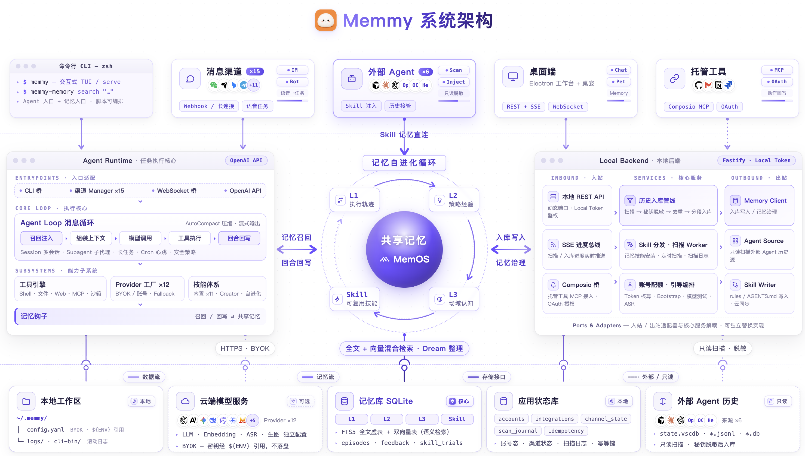

## 核心概念

| 概念 | 说明 |
| --- | --- |
| Workspace | Agent 工作目录，默认 `~/.memmy/workspace`，运行时同步模板、内置技能和记忆文件 |
| Config | `~/.memmy/config.yaml`，可用 `MEMMY_CONFIG` 或 `--config` 覆盖 |
| Agent Runtime | 模型调用、消息循环、工具注册、MCP、会话、长任务、技能、自动压缩、记忆钩子 |
| Memory Service | 本地优先记忆底座，入口 `Memory/src/server/index.ts`，默认 `:18960` |
| Local Backend | 桌面本地 API 后端：SQLite app state、权限、Cloud/Memory client、来源扫描、Skill 写入、Fastify 路由 |
| Agent Source | 外部 Agent 历史的读取适配器 + 可选 Skill 安装目标 |
| Dream | 记忆整理机制，手动或周期触发 |

