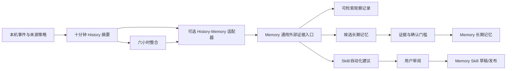

# Computer History 与 Memory 服务接入方案（2026-09-27）

## 第二轮实现：记忆整合与 Skill 候选

- 完成的十分钟摘要与已关闭、已叙述的六小时汇总都会进入 Memory 的“记忆”列表与搜索。六小时记录保存其十分钟来源的 Memory ID；History 时间线在同步成功后可直接打开对应的记忆详情。
- 已关闭的六小时汇总如果包含至少两段可提取语义操作的录制，会提交一个多来源 Skill 建议。Memory 核验这些来源已入库，模型只能选择既有操作 ID；不连贯或缺少跨来源步骤时放弃生成。
- 生成物使用现有 Skill 存储和详情，但状态是 `candidate/resolving`。审阅前不参与召回、不能调用；用户在 Skill 详情里检查步骤与来源后可启用。History 的统一入口把同一个 Skill 和支持它的多段记录放在一起，并标出待审阅状态。
- 删除来源、删除包含它的六小时汇总或关闭同步会撤回下游观察记录及相关 Skill；从独立“记忆”管理页删除观察记忆也会级联撤回来源已失效的汇总与 Skill，并留下防止重传复活的 tombstone。Memory 的模型不可用时只延迟 Skill 建议，不阻断证据同步与删除。
- 旧版已同步但未保存 Memory ID 的本地状态会用相同来源版本幂等补取 ID，从而恢复 History 内的“查看记忆”入口；若 Memory 已有删除 tombstone，则保留删除，不会由 History 重新创建。
- 同步已开启而 Memory 暂时离线时，适配器在本机最多暂存 256 组有来源 ID 的语义步骤候选，等服务恢复后再提交；这不延长原始事件的 48 小时保留期。关闭同步或删除任一来源时清除相关待提交组；同步关闭与在途上传竞争时也会撤回已到达 Memory 的证据。
- 这一流程**不把被动屏幕内容写成 User Memory、Work Memory 或已验证的 L2 Policy**。History 汇总属于有来源的观察记忆，六小时记录是跨片段整合；Skill 只有审阅后才成为可使用的操作程序。独立 Memory CLI 不需要安装或开启 History。
- 个人微信聊天的精细授权来源已合入当前本地分支；普通录制器与数据库读取器遵守同一授权门控。聊天片段不作为被动操作 Skill 的步骤证据。

仍需实机验收 macOS 浏览器私密窗口与应用覆盖、Windows 11 非浏览器应用矩阵、签名安装包中的权限和进程恢复。没有这些结果不能称为“几乎一比一”的发布质量。

## 本地验证与人测交接（2026-09-27）

- 本地 27 个 History/打包/契约测试文件共 316 项、Memory 相关 16 项、桌面 History 交互 73 项通过。Agent 类型检查通过；桌面类型检查在将三个工作区包解析到本工作树源码后通过。直接复用另一检出的 `node_modules` 会读到旧的契约构建产物，因此直接运行桌面类型检查不能代表此分支的结果。
- 在 VMware Fusion 的 Windows 11 专业版 10.0.26200 ARM64 虚拟机执行了观察器自检。实测 WinForms 密码框被 UIA 误报为普通 Pane，且其 `Name` 含密码；现用 Win32 编辑框的 `ES_PASSWORD` 样式补充识别，清空名称、标识与值。PowerShell 5.1 的 UTF-8 无 BOM 脚本会损坏直接写入的中文探针，现改用 Unicode 码点构造。修复后自检输出 `passwordRedacted: true`、`uia: true` 和正确的中文文本。临时测试脚本与本机传输服务已清理。
- 这个虚拟机是 ARM64，测试的是观察器脚本，并未在其中安装 Memmy。x64 NSIS 安装包、真实应用覆盖、隐私模式、睡眠唤醒和安装后的 Memory/Skill 全链路仍需人工验收；详见 [本地人测清单](computer-history-local-test-handoff.md)。当前分支只保留在本地，不推送、不创建 PR 或触发远程 CI。

## 2026-09-28 本地补齐

- 合并个人微信精细授权来源后，History、微信采集与 WebSocket 相关 31 个测试文件 358 项、桌面 History 4 个测试文件 75 项通过。Memory 的观察证据 HTTP 契约、CLI 与 Skill 生命周期回归通过；Agent、Memory 和桌面端（工作区源码路径）类型检查通过。
- Memory 增加只读、带 namespace 的批量证据状态接口。History 每次同步轮询一批已经入库的来源与 Skill；用户在独立记忆管理页删除观察记忆或 Skill 后，本地快捷入口会清除，已删除的观察证据不会重新上传。同步状态绑定 Memory 用户 ID，切换用户时停止自动上传并提示返回原用户处理撤回。
- ARM64 Mac 打包脚本现在暂存 SQLCipher 和 OpenSSL crypto，改写相对加载路径，附两份许可证，并校验最终 `app.asar.unpacked` 的资源。合成加密 SQLite 消息库用暂存库读取成功；签名安装包与真实微信仍待人工验收。
- Windows 11 ARM64 虚拟机此前完成观察器 UIA/密码字段自检；本轮没有 x64 Windows 11 安装包实机结果，不能将上述自动测试写成 Windows 发布验收。

## 当前实现状态

本文件后续章节保留第一轮实现时的设计依据；上面的第二轮状态为当前代码：

- Memory 新增通用 `POST /api/v1/evidence/sync`，在既有鉴权与 namespace 边界内保存 `observed_activity` L1 观察证据。来源 ID 与版本保证幂等；更新替换索引，删除 tombstone 防止重试复活。独立 Memory CLI 与 agent 对话路径不依赖 History。
- App 侧的可选适配器仅在 History 设置中主动打开时，向本机回环地址的 Memory 服务同步**已完成叙述**的十分钟摘要；关闭后撤回已同步记录。失败后按本地状态补送，清除 History 时传播删除。Memory 不可用不阻断本地 History。
- History 的来源设置会显示最近一次成功同步或失败原因；同步失败时本地记录继续，适配器定期重试。
- Memory 的搜索和时间查询可以呈现观察证据，并明确标记为未验证的历史内容，不把屏幕文字解释成用户指令或稳定偏好。观察证据不触发 raw turn、Work/User Memory 或旧的 agent 对话演化作业；第二轮增加了独立、多来源的 Skill 候选接口。
- History 的“结晶的 Skill”入口支持多个历史片段关联同一个真实 Memory Skill，点击进入现有 Skill 详情；第二轮已补候选、校验和关联生产者。
- macOS 已补焦点 AX 值变化与浏览器私密状态查询失败排除；Windows 11 新增原生前台 UI Automation 采集，应用目录合并运行中的窗口与开始菜单里的 Win32 快捷方式，便于启动前配置来源规则。Windows 浏览器暂不采集。真实应用矩阵和 Windows 主机测试尚未完成。
- Windows 11 观察器明确以 UTF-8 输出 JSON，避免中文应用名和 UIA 文本经过 PowerShell 5.1 控制台编码后损坏。新增 Windows CI：在交互桌面上用合成窗口检查 UIA 读取及密码字段抑制，核查应用目录、构建产物中的脚本和 ASAR 解包路径。该工作流只有在 Windows runner 执行成功后才构成 Windows 端验证结果；签名 NSIS 安装包及真实应用矩阵仍需实机验收。
- 修正 Windows UIA 与摘要器的角色契约：`ControlType.Text`、`ControlType.Edit` 等内容节点现在和 macOS AX 内容节点一样进入十分钟摘要证据；按钮等窗口控件仍被过滤。否则 Windows 原生采集虽然有文字，模型摘要却只能看到应用切换。
- Windows NSIS 打包脚本现在要求 `win11-observer.ps1` 实际出现在 `app.asar.unpacked`，且字节与暂存的 agent runtime 一致；不满足时拒绝产出安装包。此校验会随正式打包执行，CI 另对约束本身做检查。

第一轮只实现了证据入库、检索、删除与入口骨架。第二轮已补六小时观察整合和待审阅 Skill 建议；下文的“建议/需要”是原始设计记录，具体实现状态以上述第二轮章节为准。

## 核查基线与结论

本方案以本地 `origin/main`（`d101fd58`，9 月 23 日）和远端
`origin/v1.1.9`（`39462d6e`，9 月 24 日）作静态对比。陈嘉钦的多来源 L1
采集先在 [#465](https://github.com/MemTensor/memmy-agent/pull/465) 进入旧版本，
被 [#479](https://github.com/MemTensor/memmy-agent/pull/479) 从 1.1.8 撤回，
随后通过 [#480](https://github.com/MemTensor/memmy-agent/pull/480) 转到 1.1.9。
9 月 24 日的 [#543](https://github.com/MemTensor/memmy-agent/pull/543) 和
[#544](https://github.com/MemTensor/memmy-agent/pull/544) 也已合入 `v1.1.9`，
尚未出现在所查的 `main`。实施时应以 `v1.1.9` 或包含这些提交的后续基线为准，
避免把旧版 Memory 接口当成最终契约。

结论：保留 Memmy 已有的 History 采集与摘要管线，通过可选适配器向 Memory 服务提供
**有来源、可撤销的观察证据**。十分钟摘要进入可检索的观察层；六小时摘要负责跨窗口
整合；长期用户记忆和 Skill 需要更严格的晋级条件。现有 `completeSourceTurn` 只接受
`hook` / `agent_source_scan` 的 agent 对话身份，不能把后台电脑活动伪装成一次
用户与 agent 的对话。直接调用 `memory.add(layer: "Skill")` 会创建已激活的只读
Skill，也不适合保存未经用户审阅的 History 建议。

这里说的“拿不到原始源码”指打包前的 Electron 工程文件、原生 macOS 服务的
工程源码，以及未下发到客户端的服务端实现。`app.asar` 中的
JavaScript 和原生二进制足以分析相当多的行为。Memmy 可以用自己的云服务和模型完成
摘要、记忆整合及 Skill 生成；功能对齐不要求得到 Codex 相同的提示词、模型版本或逐字
相同的输出。

## Codex 包内可核查的功能清单

本机安装版 `26.924.22138` 的 `app.asar` 中，独立的 Chronicle 资源包括
`chronicle-settings-page`、`chronicle-permissions-dialog`、
`chronicle-service-queries`、建议提示与样式资源；共享的主进程与 worker bundle
还包含服务控制桥接和应用目录读取。静态核查可覆盖以下界面/设置行为：

| 范围 | 可见行为 | Memmy 对应工作 |
| --- | --- | --- |
| 首次启用 | 记忆依赖、隐私说明、允许全部应用或自选应用 | 增加独立同意流程和权限状态；当前已有总开关与来源规则入口 |
| 来源设置 | 应用和网站分别设置默认包含/排除、搜索应用、添加 Bundle ID 或域名 | 已在独立工作树补桌面设置入口；需验证浏览器域名归属 |
| 录制状态 | 启用、暂停、恢复、权限等待、重试；菜单栏状态项 | 统一状态机和重启恢复检查 |
| 时间线 | 十分钟与六小时摘要、按日分组、揭示文件、删除单条或按时间范围清空 | 补清空范围、来源操作、删除传播 |
| 后续动作 | 询问历史、建议 Skill/自动化 | 接入 Memory 候选与用户审阅流程 |

这些是打包产物可见的产品行为，不能从中恢复打包前的工程文件、所有服务端规则或
完全相同的模型输出。
原生服务的二进制符号提示事件 tap、AX 观察、窗口 URL 缓存和分段摘要；具体覆盖率
仍须用真实应用验证。核查详情见 [解包报告](computer-history-codex-audit.md)。

## 当前可复用的 Memmy 组件与缺口

- `App/memmy-agent/src/tools/computer-history/mac/human-recorder.swift` 已有事件 tap、
  AX 观察和前台窗口快照。本轮补充焦点 AX 值变化，并在浏览器私密状态无法确认时排除该窗口。
  各浏览器版本仍需实机覆盖测试；增加 macOS 权限只能解锁 API，不能自动保证覆盖率。
- `record-human-history.ts` 已做来源过滤、十分钟摘要、六小时聚合和模型叙述。
  `computer-history-api.ts` 已支持搜索、删除及从**完整的显式操作录制**生成
  `computer_use_workflow` Markdown。普通被动 History 不应直接成为可执行 Skill。
- Memory `v1.1.9` 已有存储、索引、搜索、记忆任务预算、语言规则、Skill 证据与
  依赖失效机制。其 L1 导入和 Work/User Memory 抽取均围绕 agent 对话；被动观察
  需独立来源类型，避免把屏幕内容误判为用户指令、偏好或承诺。
- Memory 已有两条 Skill 结晶路径：`skill-pipeline.ts` 从合格的 L2 policy 与 L1 trace
  生成并验证 Skill；`skill-cluster-pipeline.ts` 从有结果评分的 agent episode 聚合
  任务步骤。这些生成、校验、去重、存储、召回和使用反馈能力应复用。普通被动摘要缺少
  对应的 trace、任务结果与步骤证据，不能直接投给任一现有结晶作业。需要给结晶层增加
  明确的外部证据适配，或先由 History 形成经审阅的候选，再复用现有下游生命周期。

### History 与 L1 的准确关系

History 的十分钟摘要可以被理解为“第一层观察证据”，但当前 Memory 的 `L1` 是
**agent 对话 trace**：导入解析 `user/assistant/tool` 段，结晶时使用 `userText`、
`agentText`、工具调用、episode 和任务结果。直接把屏幕摘要送入现有
`memory.add(layer: "L1")` 会让网页内容或应用文本被当作对话内容，并可能触发
不合适的 Work/User Memory 和 Skill 演化。代码中无对话角色标题时，整个导入正文会
进入 `userText`；非 agent 来源还会排入 `episode_idle_close`。因此第一版保存为单独的
`observed_activity` 证据类型，复用 Memory 的索引、鉴权、预算与删除基础设施；
只有经验证的语义操作及结果证据才能进入结晶适配层。此处需要实际样本验证，
不能仅凭代码结构认定模型会处理好。

## 独立部署边界

`Memory/package.json` 已定义 `memmy-memory` CLI 和独立打包脚本；
`Memory/src/cli/npm/README.md` 说明可以只安装 Memory 服务与 agent 适配器。
因此 History 集成遵守以下方向：

```text
Memmy 桌面端 / History 采集器
        -> 可选的 History-Memory 适配器
        -> Memory 的通用外部证据接口
        -> 现有 Memory 存储、检索、预算及 Skill 管线

独立 Memory CLI / 其他 agent -> 现有 Memory 接口和管线
```

- Memory 核心不导入 Electron、macOS 录制器或 `App/memmy-agent` 的模块，也不要求
  用户安装桌面 Memmy。外部证据接口使用通用 `source`、`sourceRecordId`、`revision`
  与来源元数据，`computer_history` 的字段映射留在可选适配器。
- 适配器只在 History 已安装、用户主动开启、Memory 端点可用且该用户允许同步时运行。
  History 关闭或从未安装时，不产生观察作业、模型调用、索引项或权限请求；原有 agent
  对话采集、记忆搜索、Skill 结晶和 CLI 命令继续按现有路径工作。
- 新接口与持久化必须是向后兼容的增量；不新增 Memory 启动必填配置。适配器断线时
  History 本地采集可继续，待恢复后按来源 ID 幂等补送；Memory 独立服务继续可用。
- 发布验收覆盖四种组合：仅 Memory CLI、Memmy + Memory 且 History 未开启、
  History 开启但 Memory 不可用、两者均开启。前三种不能改变已有 Memory 结果或
  启动行为。

## 建议的数据流



### 1. 观察证据契约

在 Memory 的鉴权与 namespace 边界内增加通用 `evidence.ingest`（或等价的内部
服务方法），由可选适配器调用，而不是构造假的 `SourceTurnCompleteRequest`。
建议的核心字段：

```ts
type ExternalEvidenceIngest = {
  source: string;           // 适配器传入 computer_history；核心不依赖其实现
  sourceRecordId: string;   // History 适配器映射 historyId
  revision: string;         // History 适配器映射 summaryVersion
  evidenceKind: "observation";
  startedAt: string;
  endedAt: string;
  content: string;
  provenance: Record<string, unknown>; // 适配器放入 window、app、domain、策略版本
  parentSourceRecordIds?: string[];     // 六小时聚合指向十分钟窗口
  namespace: { userId: string; profileId?: string; projectId?: string };
};
```

`(namespace, source, sourceRecordId, revision)` 保证幂等；同一来源记录的新版本先撤销旧
索引再替换。Memory 持久化 `sourceRecordId -> memoryId / jobId / derivedId` 的来源边，
并维护删除 tombstone，避免重试任务把已删的历史重新写回来。摘要正文需按现有 Memory
敏感信息规则处理；原始事件仍遵守 History 的本地保留期，不因接入 Memory 而延长。

### 2. 分层与检索

- 十分钟摘要作为 `observed_activity` 类型的可检索证据，附时间、应用、域名及低置信
  来源标记。查询“上周我在做什么”可检索这些记录并链接回时间线。
- 六小时摘要只作整合输入与浏览条目，避免和十分钟摘要一起无差别进入召回，造成同一
  事件多次计数。需要六小时搜索时，返回聚合视图并保留子窗口引用。
- 长期 Memory 仅提取有重复证据的稳定工作主题，或由用户确认的偏好/事实。
  屏幕上看到的第三方文本、网页指令、临时状态，不能自动成为 User Memory。
  现有 Work Memory 的“用户提出/确认的需求”规则继续只读 agent 对话。
- Memory 检索结果须显示“来自电脑历史”、时间和来源应用，并允许从结果删除原始
  History。删除后该证据不得再参与召回和演化。

### 3. Skill 与工作流

History 的“你经常执行某流程”先生成**候选**，包含复用场景、语义步骤、证据窗口、
缺失步骤和失败风险。显式操作录制可提供更强的步骤证据；普通后台活动只能建议用户
是否录制或审阅。对达到步骤与结果证据门槛的候选，在现有结晶管线前增加外部证据
适配，复用其 Skill 草稿生成、验证、去重、存储、召回和反馈；无须复制一套
Skill 生成器。现有 `createWorkflow` 生成的 Markdown 可作为导入素材，
但需统一一个 Skill 身份与版本，避免 History 目录和 Memory 数据库各有一份可执行副本。
当来源窗口被清除，撤销其证据边；证据不足的 Skill 暂停，并取消相应自动化建议。

Skill 与 History 是多对多关系：一次结晶可能汇总多段十分钟记录，单段记录也可能
支持多个 Skill。适配器只在 Memory 确认 Skill 已持久化后写入关联；History 页面
显示统一的“结晶的 Skill”入口，按 Skill ID 去重列出已关联 Skill，读取 Memory 的
真实标题，点击后打开既有 Skill 详情。列表可以显示关联的 History 标题与数量。
当前实现已在 Memory 持久化并核验多个观察来源，生成待审阅 Skill 候选，再把真实 Skill ID 回写给 History 的统一入口。候选在用户审阅启用之前不会进入召回或执行。

### 4. 删除、预算与语言

- 删除单条十分钟摘要：先登记 tombstone 与取消待处理任务，再清除原始文件、Memory
  观察记录/向量、依赖的六小时整合和候选。重新整合仍存活的子窗口。
- 按范围清空：枚举命中的 `historyId`，批量执行同一流程；清空全部还要处理由这些
  历史生成的长期记忆和 Skill。当前 Memory `deleteMemory` 是单条软删除并让演化依赖
  失效，没有跨 History 来源的自动级联；此处需实现显式来源图与事务/补偿流程。
- 排除应用/网站的设置变更只影响后续采集；用户主动清除已有历史时，执行上述级联。
- 原始采集及本地写入不受 Memory 模型预算暂停影响；观察摘要整合、嵌入与 Skill
  提炼沿用 #543 的作业预算和队列暂停/恢复。沿用 #544 的语言规则生成标题、摘要
  和 Skill；旧记录不自动翻译。

## 实施顺序与验收

1. **采集正确性**：补 AX 值变更、窗口/URL 归属缓存、浏览器私密检测与失败策略；
   用 Safari、Chrome、Arc、多窗口编辑器、终端、睡眠唤醒和权限撤销场景建立矩阵。
   验收项包括未授权应用/域名零写入、私密窗口零写入、断录可见且可恢复。
2. **Memory 基线**：在包含 #480、#543、#544 的代码上实现通用外部证据接口，并在
   App 侧实现可选 History 适配器；接入幂等入库、检索和预算。保持 agent 对话 L1
   的现有行为。重放同一摘要不应重复生成记忆。
3. **删除闭环**：单条、按时间范围、全部清除覆盖原始事件、摘要、索引、候选、
   已发布 Skill 的证据；模拟队列中和模型调用中的删除，确认无复活。
4. **候选晋级**：复用现有 Skill 结晶及验证组件，为合格的 History 证据补适配；
   接入长期记忆与 Skill 审阅界面，按确认/拒绝记录决策；用误晋级、重复建议、
   证据撤销和多语言样本验收。
5. **界面补齐**：补首次启用同意、权限状态、范围清空、来源动作、建议状态与来源说明。

在第 2–4 步之间增加隔离样本门槛：用真实授权的编辑器、浏览器、终端记录与构造的
第三方指令/私密窗口样本做影子运行，不写入用户正式记忆。检查摘要是否归属正确、
是否重复、是否把页面内容误写成用户偏好、是否在删除后仍可检索，以及模型预算暂停后
能否恢复。至少在这些检查通过后，再向真实用户开放长期记忆和 Skill 晋级。

这份方案起于静态代码与安装包核查；上述“当前实现状态”记录了后续代码进展。
Codex 原生服务与 Memmy 采集器的真实应用覆盖率测试仍未完成。
