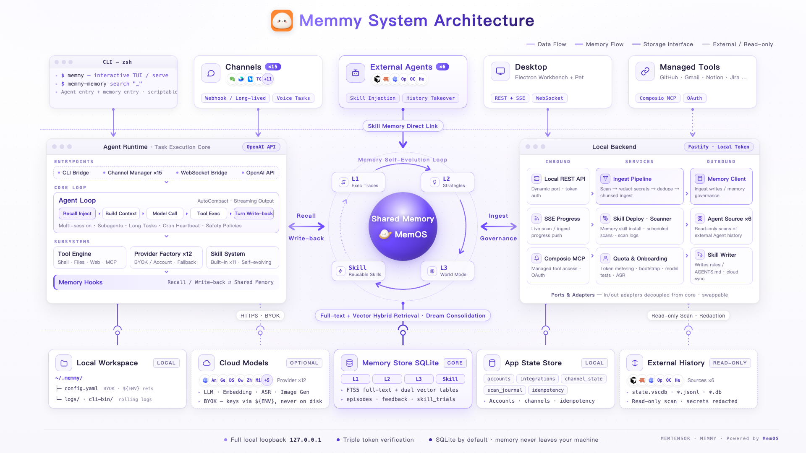

## Core Concepts

| Concept | Description |
| --- | --- |
| Workspace | The Agent's working directory, default `~/.memmy/workspace`; the runtime syncs templates, built-in skills, and memory files here |
| Config | `~/.memmy/config.yaml`, overridable via `MEMMY_CONFIG` or `--config` |
| Agent Runtime | Model calls, message loop, tool registration, MCP, sessions, long tasks, skills, auto-compaction, memory hooks |
| Memory Service | The local-first memory foundation; entry point `Memory/src/server/index.ts`, default `:18960` |
| Local Backend | Backend for the desktop local API: SQLite app state, permissions, Cloud/Memory clients, source scanning, Skill writing, Fastify routes |
| Agent Source | Read adapter for external Agent history + optional Skill install target |
| Dream | Memory consolidation mechanism, triggered manually or on a schedule |
