An Agent Source is Memmy's adapter for reading local history from an external Agent. Source scanning imports conversations that already exist; Hooks and plugins handle automatic recall and capture in new conversations.

<Callout type="warn" icon={false}>
  

    !
    History scanning and live integration are separate
  

  “Sync new” reads data the Agent has already written locally. A Hook or plugin handles automatic recall, automatic turn capture, and task resumption in new conversations. Scanning alone does not modify Agent configuration; installing a Hook or plugin writes the files listed below.
</Callout>

## Built-in sources

| Agent | Default history source | Live integration |
| --- | --- | --- |
| Cursor | `~/Library/Application Support/Cursor/User/workspaceStorage/**/state.vscdb` and `globalStorage/state.vscdb` | Hook |
| Claude Code | `~/.claude/projects/**/*.jsonl` | Hook |
| Codex | `~/.codex/sessions/<YYYY>/<MM>/<DD>/rollout-*.jsonl` | Hook |
| OpenCode | `~/.local/share/opencode/opencode.db` | Native plugin |
| OpenClaw | Conversation and memory SQLite databases under `~/.openclaw` | Memory plugin |
| Hermes | `~/.hermes/sessions/**/*.jsonl` and `~/.hermes/state.db` | Memory Provider plugin |

## Incremental sync

- **Sync new** scans every detected source; each source can also be synced individually.
- By default, Memmy reads only conversations created after the previous sync and uses watermarks and deduplication keys to avoid duplicate imports.
- Scans can be paused, resumed, or stopped; progress streams in real time over SSE.
- **Deep scan** uses `full` mode to backfill older history and requires a second confirmation.
- You can manually add an Agent outside the built-in list with a name and local data path. Manual sources support scanning only and do not receive a Hook or plugin automatically.

## Scan preferences

| Toggle | Effect |
| --- | --- |
| Auto-scan known Agents | Checks built-in sources for new conversations after Memmy starts |
| Auto incremental sync | Continues syncing when local Agent session files change |
| Auto-install Hooks/plugins for new Agents | Installs the matching live integration for a newly detected built-in Agent; the compact Skill is installed with it |

When auto-install is disabled, the Agent still appears in the list and you can click **Install Hook** or **Install plugin** manually.

## Data processing and local management

- Before import, Memmy deduplicates messages, filters sensitive data, and merges messages into conversation turns before generating memory.
- You can view the local data path (default `~/.memmy/memory-service`), open the directory, export `memory.sqlite`, or wipe local memory data after a second confirmation.
- Removing a Hook or plugin does not delete imported history. Clearing local data is a separate explicit action.

## Hook and plugin integrations

Memmy connects to live Agent conversations through each host's native **Hooks** or **plugin** system. Installing an integration also installs a compact `memmy-memory` Skill for on-demand search and retrieval when the automatically injected context is not enough.

### Integration overview

| Agent | Integration | Events or interfaces used | Main effect |
| --- | --- | --- | --- |
| Cursor | Hook | `beforeSubmitPrompt`, `afterAgentResponse`, `stop` | Starts turns, records responses, captures completed turns, and supports `/memmy-resume` |
| Claude Code | Hook | `UserPromptSubmit`, `Stop` | Recalls and injects memory before a request, captures the completed turn, and supports `/memmy-resume` |
| Codex | Hook | `UserPromptSubmit`, `Stop` | Recalls and injects memory before a request, captures the completed turn, and supports `/memmy-resume` |
| OpenCode | Native plugin | Message, tool, text-completion, and session events | Recalls memory, captures responses and tool traces, and exposes native memory tools and `/memmy-resume` |
| OpenClaw | Memory plugin | `before_prompt_build`, `agent_end` | Injects memory while building the prompt, captures the completed turn, and exposes native memory tools |
| Hermes | Memory Provider plugin | Provider lifecycle methods such as `prefetch` and `sync_turn` | Recalls and captures automatically, mirrors explicit Hermes memory writes, and exposes native memory tools |

### What happens during a turn

```mermaid
flowchart LR
  Request["User request"] --> Entry["Hook / plugin"]
  Entry --> Start["Open session and start turn"]
  Start --> Recall["Retrieve relevant Memmy memory"]
  Recall --> Context["Inject it as historical context"]
  Context --> Agent["Agent performs the task"]
  Agent --> Complete["Capture answer, status, and available tool traces"]
  Complete --> Memory["Complete the turn in the local Memory service"]
```

Common results after installation:

- **Automatic recall:** Claude Code, Codex, OpenCode, OpenClaw, and Hermes retrieve and inject relevant memory before normal requests run.
- **Automatic capture:** the Hook or plugin submits the user request, Agent answer, and success/failure status at the end of a turn. The Agent does not need to run `memmy-memory add` manually.
- **Task resumption:** `/memmy-resume <query>` returns up to five L1 episode candidates. Enter `1`–`5` to load the complete episode and inject continuation context.
- **On-demand lookup:** the bundled Skill keeps `memmy-memory search` and `memmy-memory get` for cases where automatic context is insufficient.
- **Source attribution:** captured turns carry `cursor`, `claude_code`, `codex`, `opencode`, `openclaw`, or `hermes`, so you can filter and trace their origin.

<Callout type="warn" icon={false}>
  

    !
    Cursor's current Hook focuses on automatic capture and <code>/memmy-resume</code>
  

  When a normal Cursor request needs additional memory, the bundled Skill performs an on-demand lookup. The other five integrations inject recalled context before normal requests.
</Callout>

### Cursor: three Hooks

Memmy appends its own entries to `~/.cursor/hooks.json` without replacing other Hooks.

| Hook | When it runs | What Memmy does |
| --- | --- | --- |
| `beforeSubmitPrompt` | Before the user request is submitted | Opens or reuses a Memmy session, starts a turn, stores the request, and handles `/memmy-resume` search and selection |
| `afterAgentResponse` | After the Agent produces a response | Stores the final response in the current turn state for the completion Hook |
| `stop` | When the Agent turn stops | Combines the request and response and calls turn-complete; failures are allowed through and do not block Cursor |

Written or updated by default:

- `~/.cursor/hooks.json`
- `~/.cursor/hooks/memmy-resume-hook.mjs`
- `~/.cursor/hooks/memmy-memory-config.json`
- `~/.cursor/skills/memmy-memory/SKILL.md`

### Claude Code: `UserPromptSubmit` and `Stop`

| Hook | When it runs | What Memmy does |
| --- | --- | --- |
| `UserPromptSubmit` | Before the user request reaches the model | Starts a Memmy turn, puts recalled memory into `additionalContext`, and handles `/memmy-resume` |
| `Stop` | When Claude Code completes or terminates a turn | Reads the request and answer from the Hook payload or transcript, then completes the turn as `succeeded`, `failed`, or `cancelled` |

Written or updated by default:

- `~/.claude/settings.json`
- `~/.claude/hooks/memmy-resume-hook.mjs`
- `~/.claude/hooks/memmy-memory-config.json`
- `~/.claude/commands/memmy-resume.md`
- `~/.claude/CLAUDE.md`
- `~/.claude/skills/memmy-memory/SKILL.md`

### Codex: `UserPromptSubmit` and `Stop`

| Hook | When it runs | What Memmy does |
| --- | --- | --- |
| `UserPromptSubmit` | Before the user request is submitted | Starts a turn, injects recalled memory through Hook `additionalContext`, and handles `/memmy-resume` |
| `Stop` | When the Codex turn stops | Extracts the answer from the transcript or last Assistant message, completes the turn, and preserves failed or cancelled status |

Written or updated by default:

- `~/.codex/hooks.json`
- `~/.codex/hooks/memmy-resume-hook.mjs`
- `~/.codex/hooks/memmy-memory-config.json`
- `~/.codex/AGENTS.md`
- `~/.codex/skills/memmy-memory/SKILL.md`

### OpenCode: native plugin

| Callback | Effect |
| --- | --- |
| `chat.message` | Starts a turn, injects recalled memory automatically, and handles `/memmy-resume` |
| `tool.execute.before` / `tool.execute.after` | Captures non-Memmy tool arguments and results as part of the turn trace |
| `experimental.text.complete` / `message.part.updated` | Collects the complete Assistant text output |
| `session.error` | Marks the current turn failed and stores the error |
| `session.idle` | Completes and captures the current turn asynchronously |
| `dispose` | Flushes turns that have not yet been submitted before the plugin unloads or the process exits |

The plugin also registers the native `memmy_memory_search`, `memmy_memory_get`, and `memmy_memory_add` tools.

Written or updated under `~/.config/opencode` by default:

- `plugins/memmy-memory.js`
- `plugins/memmy-memory-config.json`
- `commands/memmy-resume.md`
- `AGENTS.md`
- `skills/memmy-memory/SKILL.md`

If `OPENCODE_CONFIG_DIR` or `XDG_CONFIG_HOME` is set, Memmy writes to the corresponding configuration directory instead.

### OpenClaw: Memory plugin

| Interface | Effect |
| --- | --- |
| `registerMemoryCapability` | Tells OpenClaw that Memmy is active and that injected content is historical context |
| `before_prompt_build` | Starts a turn before prompt construction and injects recalled memory or a selected episode through `prependContext` |
| `agent_end` | Extracts the request, answer, and tool trace and completes the turn synchronously so capture is not lost on process exit |
| `registerCommand` | Registers `/memmy-resume` |
| `registerTool` | Registers `memmy_memory_search`, `memmy_memory_get`, and `memmy_memory_add` |

Installation points `plugins.slots.memory` to `memmy-memory` and enables `allowPromptInjection` and `allowConversationAccess`.

Written or updated by default:

- `~/.openclaw/extensions/memmy-memory/`
- `~/.openclaw/openclaw.json`
- `~/.openclaw/skills/memmy-memory/SKILL.md`
- `AGENTS.md` in the OpenClaw workspace (default `~/.openclaw/workspace/AGENTS.md`)

OpenClaw has one memory-provider slot. If another memory plugin is already active, Memmy asks whether to replace it or keep it and install only the Skill.

### Hermes: Memory Provider plugin

| Provider interface / Hook | Effect |
| --- | --- |
| `system_prompt_block` | Declares that Memmy is active and that injected memory is historical context only |
| `prefetch` | Starts a turn before the user request and returns relevant memory context |
| `sync_turn` | Completes the turn in a background thread and captures the user request and Assistant answer |
| `on_memory_write` | Mirrors explicit memory writes from Hermes into Memmy |
| `on_session_switch` | Keeps the Memmy session aligned with the active Hermes session |
| `get_tool_schemas` / `handle_tool_call` | Exposes `memmy_memory_search`, `memmy_memory_get`, and `memmy_memory_add` |
| `pre_llm_call` / `pre_gateway_dispatch` | Recognizes a `/memmy-resume` candidate number and injects or rewrites it as full episode context |

Installation sets `memory.provider` to `memmy-memory`, enables the `memory` toolset, and enables the standalone `memmy-resume` command plugin.

Written or updated by default:

- `~/.hermes/plugins/memmy-memory/`
- `~/.hermes/plugins/memmy-resume/`
- `~/.hermes/config.yaml`
- `~/.hermes/SOUL.md`
- `~/.hermes/skills/memmy-memory/SKILL.md`

Hermes likewise allows one active Memory Provider. Memmy asks for confirmation before replacing another provider.

### Install, verify, and remove

1. Open **Memory → Cross-Agent access**.
2. For Cursor, Claude Code, and Codex, click **Install Hook**. For OpenCode, OpenClaw, and Hermes, click **Install plugin**.
3. If the Agent is already running, restart it or open a new session so it reloads its configuration.
4. Complete a normal turn, then confirm that the corresponding source appears in Memmy's memory or log views.
5. Enter `/memmy-resume <keywords>`, confirm that candidates appear, and select an episode with `1`–`5`.

When you click **Remove Hook** or **Remove plugin**, Memmy disables and cleans up the live integration and bundled Skill it manages. Other Hook configuration is preserved, and memories already stored in Memmy are not deleted.

### Local access and failure behavior

- Hooks and plugins read the Memory service endpoint and token from `~/.memmy/config.yaml` and keep the runtime configuration they need in the Agent's local config directory. Do not publish these config files.
- Injected content is wrapped in `<memmy_memory_context>` as historical memory, while `<current_user_request>` identifies the authoritative current request. This reduces the risk of treating old memory as a new instruction.
- Recall and capture are **fail-open**: errors are logged and the Agent continues its current task instead of being interrupted when the Memory service is temporarily unavailable.
- Host Hook commands have a 60-second timeout; individual Memory requests have a 45-second timeout.
